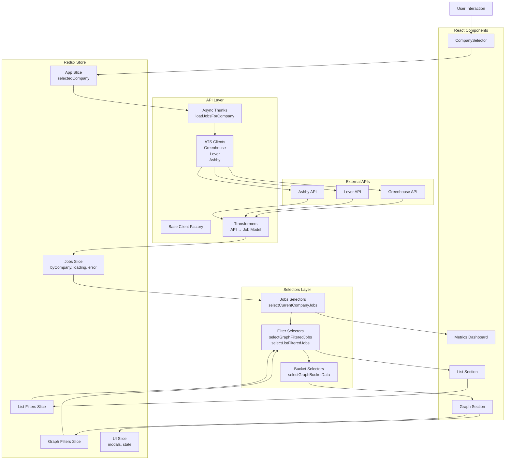
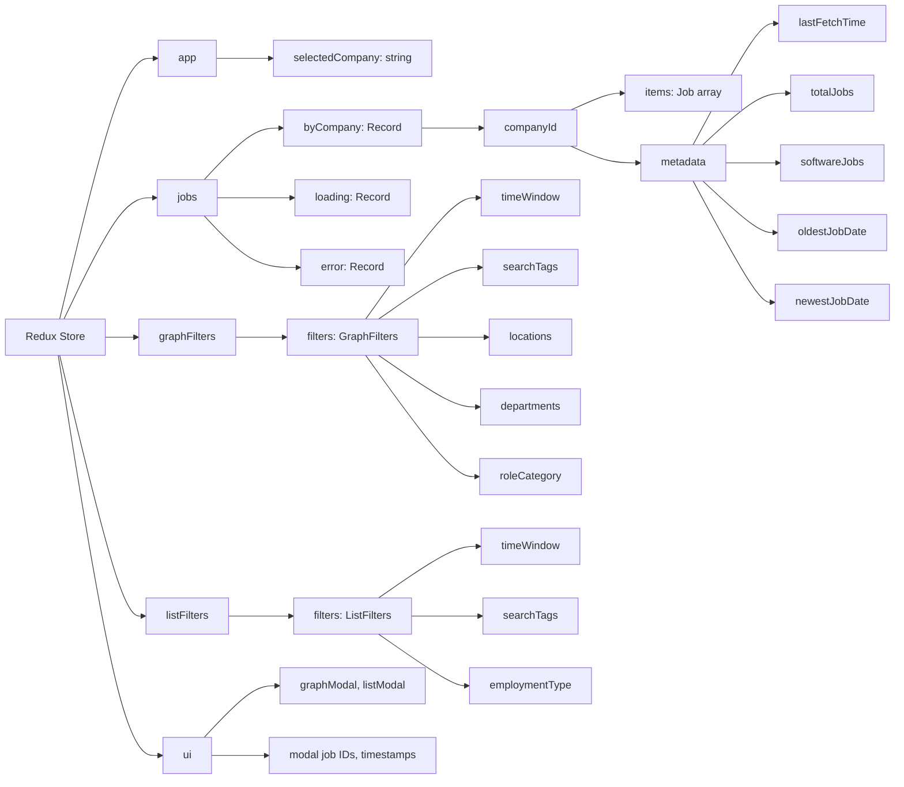
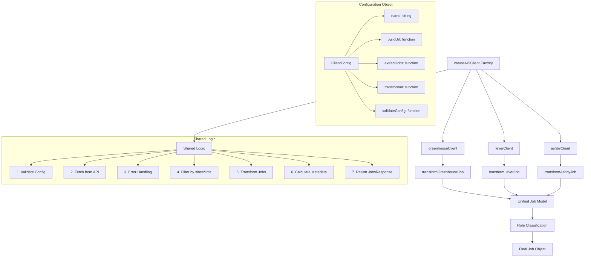
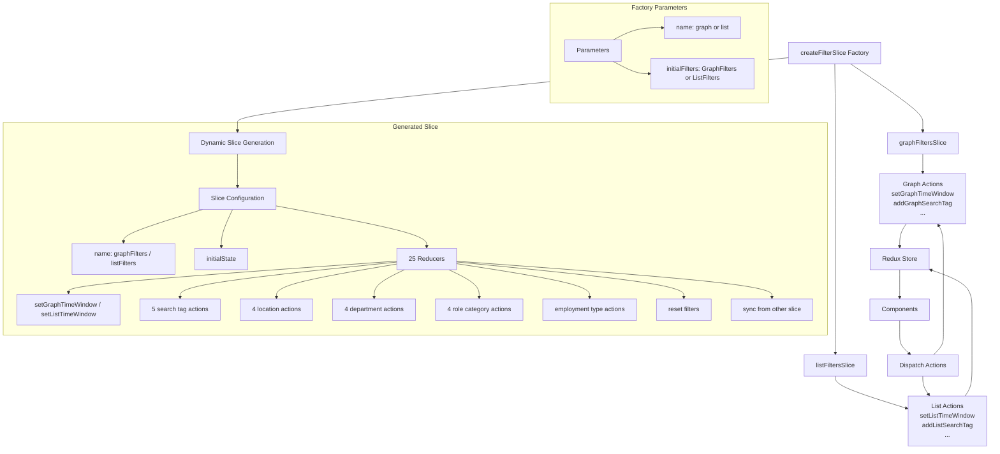
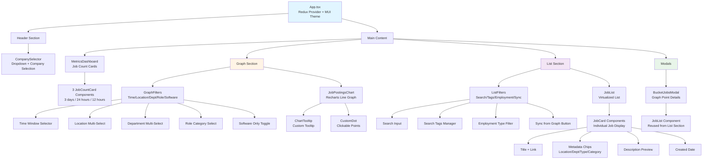
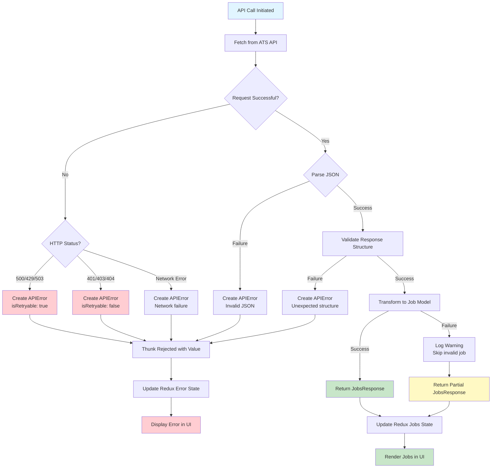

# Architecture Overview

This document provides visual diagrams and detailed explanations of the Job Visualizer application architecture.

## Table of Contents

1. [High-Level Data Flow](#high-level-data-flow)
2. [Redux State Shape](#redux-state-shape)
3. [API Client Architecture](#api-client-architecture)
4. [Filter Slice Architecture](#filter-slice-architecture)
5. [Component Hierarchy](#component-hierarchy)
6. [Time Bucketing Algorithm](#time-bucketing-algorithm)
7. [Role Classification System](#role-classification-system)

---

## High-Level Data Flow

This diagram shows how data flows through the application from user interaction to UI updates.



### Key Data Flow Patterns

1. **User selects company** → Dispatches `setSelectedCompanyId` action
2. **App slice updates** → `useCompanyLoader` hook detects change
3. **Thunk dispatched** → `loadJobsForCompany` starts async operation
4. **API client selected** → Based on company's ATS type (Greenhouse/Lever/Ashby)
5. **Data fetched** → External API returns job data
6. **Transformation** → Raw API response converted to normalized `Job` model
7. **Role classification** → Algorithm categorizes each job
8. **Redux updated** → Jobs stored in `byCompany` map with metadata
9. **Selectors recompute** → Memoized selectors filter/transform data
10. **Components re-render** → Only affected components update

---

## Redux State Shape

Visual representation of the Redux store structure.



### State Structure Details

**Jobs Slice:**
```typescript
{
  byCompany: {
    [companyId]: {
      items: Job[],          // Normalized job array
      metadata: {
        lastFetchTime: string,
        totalJobs: number,
        softwareJobs: number,
        oldestJobDate: string,
        newestJobDate: string
      }
    }
  },
  loading: { [companyId]: boolean },
  error: { [companyId]: string | null }
}
```

**Filter Slices (Graph & List are identical structure):**
```typescript
{
  filters: {
    timeWindow: TimeWindow,
    searchTags?: SearchTag[],
    locations: string[],
    departments: string[],
    employmentType?: EmploymentType,
    roleCategory?: SoftwareRoleCategory
  }
}
```

**Important Notes:**
- Graph and list filters are **completely independent**
- `softwareOnly` computed via selector (not stored in state)
- Jobs normalized by company ID for efficient lookup
- Metadata calculated during transformation

---

## API Client Architecture

Diagram showing the factory pattern for API clients.



### Factory Pattern Benefits

1. **Code Reuse**: 220+ lines of duplication eliminated
2. **Consistency**: All clients use identical error handling, filtering, metadata calculation
3. **Easy Extension**: Add new ATS provider in ~15 lines instead of 74
4. **Single Source of Truth**: One place to fix bugs affecting all clients
5. **Type Safety**: Generic types ensure correct configuration

### Adding a New ATS Provider

```typescript
// Only ~15 lines needed!
export const newATSClient = createAPIClient<NewATSResponse, NewATSConfig>({
  name: 'NewATS',
  buildUrl: (config) => `${config.apiBaseUrl}/jobs`,
  extractJobs: (response) => response.jobs,
  transformer: transformNewATSJob,
  validateConfig: (config): config is NewATSConfig => config.type === 'newats',
});
```

---

## Filter Slice Architecture

Diagram showing the filter slice factory pattern.



### Factory Pattern Benefits

1. **Code Reuse**: 158 lines of duplication eliminated
2. **Consistency**: Both slices have identical action patterns
3. **Maintainability**: One place to add new filter types
4. **Type Safety**: Dynamic action creator types maintained
5. **Independence**: Graph and list filters remain completely separate

### Filter Slice Structure

Both graph and list slices support:

**Search Tag Actions (5):**
- Add tag (include/exclude)
- Remove tag
- Toggle tag mode
- Clear all tags

**Location/Department/RoleCategory Actions (4 each):**
- Add single value
- Remove single value
- Clear all
- Set array

**Other Actions:**
- Set time window
- Set employment type
- Reset to initial state
- Sync from other slice (graph ↔ list)

---

## Component Hierarchy

Visual representation of the component tree.



### Component Responsibility Summary

**App.tsx:**
- Redux Provider setup
- MUI Theme configuration
- Main layout structure
- Route handling (currently single page)

**CompanySelector:**
- Company dropdown
- Auto-loads jobs via `useCompanyLoader` hook
- Single dispatch (no double loading)

**MetricsDashboard:**
- Displays job counts for multiple time windows
- Uses `useTimeBasedJobCounts` hook
- No timer-based re-renders (deterministic calculations)

**Graph Section:**
- Independent filter system
- Memoized bucket data via selectors
- Recharts integration
- Click-to-drill-down functionality

**List Section:**
- Independent filter system
- Search with include/exclude tags
- Can sync filters from graph
- Job cards with metadata

**BucketJobsModal:**
- Fullscreen on mobile
- Reuses JobList component
- Displays jobs for clicked graph point
- Memoized job filtering

---

## Time Bucketing Algorithm

```mermaid
graph TB
    Start[Start: Jobs Array + Time Window]

    Start --> GetWindow[Get Time Window Duration]
    GetWindow --> CalcBucketSize[Calculate Bucket Size<br/>30m → 5min<br/>1h → 10min<br/>24h → 1hr<br/>7d → 1day]

    CalcBucketSize --> CalcRange[Calculate Time Range<br/>endTime = now<br/>startTime = now - window]

    CalcRange --> CreateBuckets[Create Empty Buckets]

    CreateBuckets --> Loop{For each bucket interval}

    Loop --> RoundStart[Round to bucket boundary<br/>align to bucket size]
    RoundStart --> CreateBucket[Create TimeBucket object<br/>bucketStart, bucketEnd<br/>jobs: array, count: 0]

    CreateBucket --> NextBucket{More buckets?}
    NextBucket -->|Yes| Loop
    NextBucket -->|No| FillBuckets[Fill Buckets with Jobs]

    FillBuckets --> JobLoop{For each job}
    JobLoop --> CheckTime{Job createdAt in range?}
    CheckTime -->|No| JobLoop
    CheckTime -->|Yes| FindBucket[Find matching bucket<br/>by timestamp]

    FindBucket --> AddJob[Add job ID to bucket<br/>Increment count]
    AddJob --> MoreJobs{More jobs?}
    MoreJobs -->|Yes| JobLoop
    MoreJobs -->|No| CalcCumulative[Calculate Cumulative Counts]

    CalcCumulative --> Cumulative[For each bucket:<br/>cumulativeCount = previous + current]
    Cumulative --> Sort[Sort buckets chronologically]
    Sort --> Return[Return TimeBucket array]

    Return --> End[End: Ready for Graph]

    style Start fill:#e1f5ff
    style End fill:#c8e6c9
    style CreateBuckets fill:#fff9c4
    style FillBuckets fill:#fff9c4
    style CalcCumulative fill:#fff9c4
```

Flowchart showing how jobs are bucketed for graph visualization.



### Bucket Size Mapping

| Time Window | Bucket Size | Max Buckets | Purpose |
|-------------|-------------|-------------|---------|
| 30m | 5 minutes | 6 | High granularity for recent activity |
| 1h | 10 minutes | 6 | Short-term trends |
| 3h | 30 minutes | 6 | Medium-term patterns |
| 6h | 1 hour | 6 | Half-day overview |
| 12h | 1 hour | 12 | Daily patterns |
| 24h | 1 hour | 24 | Full day cycle |
| 3d | 6 hours | 12 | Multi-day trends |
| 7d | 1 day | 7 | Weekly overview |
| 14d | 1 day | 14 | Two-week patterns |
| 30d | 1 day | 30 | Monthly view |
| 90d | 3 days | 30 | Quarterly trends |
| 180d | 6 days | 30 | Half-year overview |
| 1y | 12 days | 30 | Annual patterns |
| 2y | 24 days | 30 | Two-year trends |

### Key Algorithm Features

1. **Empty Buckets**: Created for entire range (critical for proper graph spacing)
2. **Boundary Alignment**: Buckets align to clean boundaries (e.g., top of hour)
3. **Cumulative Counts**: For line graph visualization
4. **Job ID Storage**: Enables drill-down to individual jobs
5. **Time Complexity**: O(n + b) where n = jobs, b = buckets
6. **Memoization**: Results cached via Redux selectors

---

## Role Classification System

Flowchart showing how jobs are classified into role categories.

```mermaid
graph TB
    Start[Start: Job Object]

    Start --> Extract[Extract Text<br/>title + location + description + dept]
    Extract --> Normalize[Normalize Text<br/>lowercase, trim]

    Normalize --> CheckExclusion{Check Exclusion Patterns<br/>recruiter, coordinator, etc.}
    CheckExclusion -->|Match Found| ReturnNonTech[Return: nonTech<br/>confidence: 0.9]

    CheckExclusion -->|No Match| InitVars[Initialize:<br/>matchCounts = empty<br/>baseConfidence = 0.5]

    InitVars --> CategoryLoop{For each category<br/>frontend, backend, etc.}

    CategoryLoop --> GetKeywords[Get keywords for category]
    GetKeywords --> KeywordLoop{For each keyword}

    KeywordLoop --> CheckKeyword{Keyword in text?}
    CheckKeyword -->|No| NextKeyword{More keywords?}
    CheckKeyword -->|Yes| RecordMatch[Record match]

    RecordMatch --> CheckTitle{Keyword in title?}
    CheckTitle -->|Yes| TitleBonus[Store: titleMatch = true]
    CheckTitle -->|No| NextKeyword
    TitleBonus --> NextKeyword

    NextKeyword -->|Yes| KeywordLoop
    NextKeyword -->|No| NextCategory{More categories?}
    NextCategory -->|Yes| CategoryLoop

    NextCategory -->|No| CheckMatches{Any matches found?}
    CheckMatches -->|No| CheckTech{In tech department?}

    CheckTech -->|Yes| ReturnOtherTech[Return: otherTech<br/>confidence: 0.6]
    CheckTech -->|No| ReturnNonTech2[Return: nonTech<br/>confidence: 0.3]

    CheckMatches -->|Yes| SelectBest[Select category with<br/>most keyword matches]

    SelectBest --> CalcConfidence[Calculate Confidence]

    CalcConfidence --> BaseConf[Start: 0.5]
    BaseConf --> AddMatches[Add: matchCount × 0.1<br/>max 0.85]
    AddMatches --> AddTitle{Title match?}
    AddTitle -->|Yes| TitleBonusConf[Add: 0.15]
    AddTitle -->|No| CheckDept{Tech department?}
    TitleBonusConf --> CheckDept

    CheckDept -->|Yes| DeptBonus[Add: 0.05]
    CheckDept -->|No| Clamp[Clamp to max 0.95]
    DeptBonus --> Clamp

    Clamp --> OtherTechCheck{Category = otherTech?}
    OtherTechCheck -->|Yes| OtherTechCap[Cap at 0.75]
    OtherTechCheck -->|No| FinalConf[Final Confidence]
    OtherTechCap --> FinalConf

    FinalConf --> Return[Return: category + confidence]
    ReturnNonTech --> End[End: RoleClassification]
    ReturnOtherTech --> End
    ReturnNonTech2 --> End
    Return --> End

    style Start fill:#e1f5ff
    style End fill:#c8e6c9
    style ReturnNonTech fill:#ffcdd2
    style ReturnOtherTech fill:#fff9c4
    style ReturnNonTech2 fill:#ffcdd2
    style Return fill:#c8e6c9
```



### Role Categories (14 Total)

**Software Engineering Roles:**
1. **frontend** - React, Vue, Angular, UI/UX
2. **backend** - API, microservices, server-side
3. **fullstack** - Full-stack, end-to-end
4. **mobile** - iOS, Android, React Native
5. **data** - Data engineer, analytics, pipelines
6. **ml** - Machine learning, AI, ML engineer
7. **devops** - DevOps, SRE, infrastructure
8. **platform** - Platform, infrastructure, tooling
9. **qa** - QA, test, SDET
10. **security** - Security, infosec, AppSec
11. **graphics** - Graphics, rendering, game
12. **embedded** - Embedded, firmware, hardware

**Non-Engineering Roles:**
13. **otherTech** - Generic software/tech (fallback)
14. **nonTech** - Non-technical roles

### Confidence Scoring

| Factor | Impact | Calculation |
|--------|--------|-------------|
| Base confidence | +0.5 | Starting point for any match |
| Each keyword match | +0.1 | Up to 0.85 total from keywords |
| Keyword in title | +0.15 | Bonus for title mentions |
| Tech department | +0.05 | Small bonus for tech dept |
| Maximum confidence | 0.95 | Upper limit (except exclusions) |
| otherTech category | 0.75 cap | Lower confidence for generic |
| Exclusion patterns | 0.9 | High confidence for non-tech |

### Example Classification

```
Job Title: "Senior Frontend Engineer"
Department: "Engineering"
Description: "React, TypeScript, Redux..."

1. Extract text → "senior frontend engineer engineering react typescript redux"
2. Check exclusions → No match
3. Scan categories:
   - frontend: 3 matches (frontend, react, redux)
   - backend: 0 matches
   - fullstack: 0 matches
   ...
4. Best category: frontend (3 matches)
5. Calculate confidence:
   - Base: 0.5
   - 3 matches: +0.3
   - "frontend" in title: +0.15
   - Tech department: +0.05
   - Total: 1.0 → clamped to 0.95
6. Return: { category: 'frontend', confidence: 0.95 }
```

---

## Performance Optimizations

```mermaid
graph LR
    State[Redux State Changes]

    State --> Selectors[Memoized Selectors]

    Selectors --> L1[Level 1: Basic Selectors<br/>selectCurrentCompanyJobs<br/>selectGraphFilters]

    L1 --> L2[Level 2: Filtering<br/>selectGraphFilteredJobs<br/>selectListFilteredJobs]

    L2 --> L3[Level 3: Transformations<br/>selectGraphBucketData<br/>selectAvailableLocations]

    L3 --> Components[React Components]

    Components --> UseMemo[useMemo Hooks<br/>Chart data transformation<br/>Bucket job filtering]

    UseMemo --> UseCallback[useCallback Hooks<br/>Event handlers<br/>Modal actions]

    UseCallback --> Render[Final Render]

    style State fill:#e1f5ff
    style Selectors fill:#fff9c4
    style Components fill:#f3e5f5
    style Render fill:#c8e6c9
```

### Memoization Strategy



### Re-render Prevention

1. **Selector Memoization**: Redux selectors use `createSelector` from Reselect
2. **Component Memoization**: Chart data wrapped in `useMemo`
3. **Filter Independence**: Graph and list filters don't affect each other
4. **Deterministic Calculations**: No timer-based updates in MetricsDashboard
5. **Single Dispatch**: CompanySelector doesn't double-dispatch loads

### Performance Benchmarks

| Operation | Time Complexity | Notes |
|-----------|----------------|-------|
| Load jobs | O(n) | n = number of jobs |
| Role classification | O(n × k) | k = average keywords per job (~10) |
| Time bucketing | O(n + b) | b = number of buckets (~30 max) |
| Filter by location | O(n) | Memoized, only runs when filters change |
| Filter by role category | O(n) | Memoized, only runs when filters change |
| Graph data transformation | O(b) | Memoized with useMemo |
| Bucket job filtering | O(n) | Memoized with useMemo |

---

## Error Handling Flow



---

## Summary

This architecture provides:

1. **Separation of Concerns**: Clear boundaries between API, state, and UI layers
2. **Code Reuse**: Factory patterns eliminate duplication
3. **Performance**: Aggressive memoization at all levels
4. **Maintainability**: Easy to extend with new ATS providers or filter types
5. **Type Safety**: Full TypeScript coverage with strict mode
6. **Testability**: Pure functions and dependency injection throughout
7. **Error Resilience**: Comprehensive error handling with retryable failures
8. **Scalability**: Handles 1000+ jobs efficiently with bucketing and virtualization

For implementation details, see `CLAUDE.md`. For migration guidance, see `docs/MIGRATION.md`.
