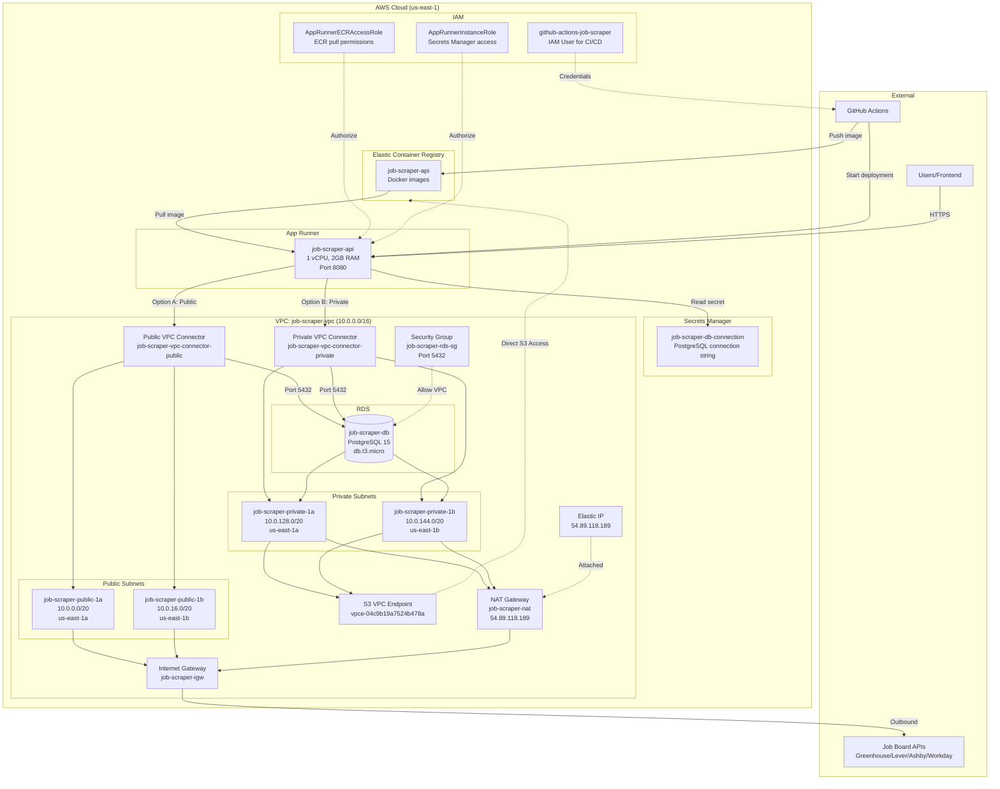

# AWS Resources Documentation - Job Scraper

## Overview

This document summarizes all AWS resources used in the Job Scraper deployment, their purposes, and how they interact.

---

## Architecture Diagram



---

## Resource Inventory

### 1. VPC & Networking

| Resource | Name | Purpose |
|----------|------|---------|
| **VPC** | `job-scraper-vpc` | Isolated network (CIDR: 10.0.0.0/16) containing all resources |
| **Internet Gateway** | `job-scraper-igw` | Enables internet access for public subnets |
| **NAT Gateway** | `job-scraper-nat` | Provides outbound internet access for private subnets with static IP (54.89.118.189) |
| **Elastic IP** | `eipalloc-0e0366effd3d10049` | Static public IP (54.89.118.189) attached to NAT Gateway |
| **Public Subnet 1** | `job-scraper-public-1a` | Public subnet (10.0.0.0/20, us-east-1a) - NAT Gateway location |
| **Public Subnet 2** | `job-scraper-public-1b` | Public subnet (10.0.16.0/20, us-east-1b) |
| **Private Subnet 1** | `job-scraper-private-1a` | Private subnet (10.0.128.0/20, us-east-1a) - RDS and private VPC Connector |
| **Private Subnet 2** | `job-scraper-private-1b` | Private subnet (10.0.144.0/20, us-east-1b) - RDS and private VPC Connector |
| **Public Route Table** | `job-scraper-rtb-public` | Routes public subnet traffic (0.0.0.0/0) to Internet Gateway |
| **Private Route Table 1** | `job-scraper-rtb-private1-us-east-1a` | Routes private subnet 1 traffic (0.0.0.0/0) to NAT Gateway |
| **Private Route Table 2** | `job-scraper-rtb-private2-us-east-1b` | Routes private subnet 2 traffic (0.0.0.0/0) to NAT Gateway |
| **S3 VPC Endpoint** | `vpce-04c9b19a7524b478a` | Gateway endpoint for private S3 access without NAT Gateway charges |

### 2. Security

| Resource | Name | Purpose |
|----------|------|---------|
| **Security Group (RDS)** | `job-scraper-rds-sg` | Controls RDS access - allows port 5432 from VPC CIDR only |
| **Security Group (Public Connector)** | `sg-067cb0998fb92d6ac` | Controls public VPC Connector access |
| **Security Group (Private Connector)** | `sg-0badfb32c371b195a` | Controls private VPC Connector access - allows port 5432 to RDS and all outbound traffic |
| **Public VPC Connector** | `job-scraper-vpc-connector-public` | Bridges App Runner to public subnets for direct internet access (cost-optimized) |
| **Private VPC Connector** | `job-scraper-vpc-connector-private` | Bridges App Runner to private subnets for NAT Gateway routing (security-optimized) |

### 3. Database

| Resource | Name | Purpose |
|----------|------|---------|
| **RDS Instance** | `job-scraper-db` | PostgreSQL 15 database (db.t3.micro, 20GB gp3) |
| **DB Subnet Group** | `job-scraper-db-subnet` | Groups private subnets for RDS multi-AZ |

### 4. Container Infrastructure

| Resource | Name | Purpose |
|----------|------|---------|
| **ECR Repository** | `job-scraper-api` | Stores Docker images for the .NET API |
| **App Runner Service** | `job-scraper-api` | Runs the containerized API (1 vCPU, 2GB, port 8080) |

### 5. Secrets & Configuration

| Resource | Name | Purpose |
|----------|------|---------|
| **Secrets Manager Secret** | `job-scraper-db-connection` | Stores PostgreSQL connection string securely |

### 6. IAM (Identity & Access)

| Resource | Name | Purpose |
|----------|------|---------|
| **IAM Role** | `AppRunnerECRAccessRole` | Allows App Runner to pull images from ECR |
| **IAM Role** | `AppRunnerInstanceRole` | Allows App Runner instances to read secrets |
| **IAM User** | `github-actions-job-scraper` | CI/CD credentials for GitHub Actions |
| **IAM Policy** | `GitHubActionsDeployPolicy` | Grants ECR push + App Runner deploy permissions |
| **IAM Policy** | `SecretsManagerAccess` | Grants GetSecretValue on the DB connection secret |

---

## Data Flow Summary

### Request Flow (User → API → Database)
1. User sends HTTPS request to App Runner service URL
2. App Runner routes to container running on port 8080
3. API reads connection string from Secrets Manager (via Instance Role)
4. API connects to RDS through VPC Connector (public or private) → Private Subnet
5. Response returns through same path

### Scraper Flow (API → External APIs)

**Option A: Public VPC Connector (Cost-Optimized)**
1. Scraper service in App Runner initiates HTTP request
2. Request goes through Public VPC Connector → Public Subnet → Internet Gateway
3. External job board API (Greenhouse/Lever/Ashby/Workday) responds
4. Data is processed and stored in RDS
5. Source IP: Dynamic (changes with App Runner instance)

**Option B: Private VPC Connector (Security-Optimized)**
1. Scraper service in App Runner initiates HTTP request
2. Request goes through Private VPC Connector → Private Subnet → NAT Gateway → Internet Gateway
3. External job board API (Greenhouse/Lever/Ashby/Workday) responds
4. Data is processed and stored in RDS
5. Source IP: Static (54.89.118.189) - suitable for API whitelisting

**S3 Access (via VPC Endpoint)**
- Private subnets access S3 (e.g., ECR images) through VPC Endpoint Gateway
- No NAT Gateway charges for S3 traffic
- Direct, private connection within AWS network

### Deployment Flow (GitHub → AWS)
1. Push to `main` branch triggers GitHub Actions
2. GitHub Actions authenticates with IAM User credentials
3. Docker image built and pushed to ECR
4. `aws apprunner start-deployment` triggers new deployment
5. App Runner pulls new image (via ECR Access Role) and deploys

---

## VPC Connector Options

This infrastructure supports two VPC Connector configurations to balance cost and security requirements:

### Public Connector (Cost-Optimized)
- **Name**: `job-scraper-vpc-connector-public`
- **Created**: 2025-12-31 12:07:39 UTC
- **Subnets**: Public subnets in us-east-1a (10.0.0.0/20) and us-east-1b (10.0.16.0/20)
- **Security Group**: `sg-067cb0998fb92d6ac`
- **Routing**: Direct to Internet Gateway
- **Use Cases**:
  - Development and testing environments
  - Cost-sensitive deployments
  - Applications that don't require IP whitelisting
- **Cost Savings**: Eliminates NAT Gateway charges (~$32/month)
- **Trade-offs**:
  - Dynamic egress IP (changes with App Runner instances)
  - Less isolation from internet

### Private Connector (Security-Optimized)
- **Name**: `job-scraper-vpc-connector-private`
- **Created**: 2025-12-31 18:04:42 UTC
- **Subnets**: Private subnets in us-east-1a (10.0.128.0/20) and us-east-1b (10.0.144.0/20)
- **Security Group**: `sg-0badfb32c371b195a`
- **Routing**: Through NAT Gateway with static egress IP (54.89.118.189)
- **Use Cases**:
  - Production environments
  - Applications requiring IP whitelisting for external APIs
  - Enhanced security and compliance requirements
- **Benefits**:
  - **Predictable egress IP**: Static IP (54.89.118.189) for API whitelisting
  - **Better security posture**: No direct internet exposure of App Runner instances
  - **S3 optimization**: Access S3 via VPC Endpoint (no NAT Gateway charges for S3)
  - **Network isolation**: Enhanced security through private subnet architecture
- **Additional Cost**: ~$32/month for NAT Gateway + ~$3.60/month for Elastic IP

### Current Status
Both connectors are deployed and available. The App Runner service can be configured to use either connector by updating the service's network configuration. Choose based on your requirements:
- Use **public connector** for development or when cost is the primary concern
- Use **private connector** for production or when security/IP whitelisting is required

---

## Cost Breakdown (Monthly Estimate)

### With Private VPC Connector (Current NAT Gateway Setup)

| Service | Cost |
|---------|------|
| RDS db.t3.micro | ~$15 |
| App Runner (1 vCPU, 2GB) | ~$25-50 |
| NAT Gateway | ~$32 |
| Elastic IP (NAT Gateway) | ~$3.60 |
| ECR Storage | ~$1 |
| Secrets Manager | ~$0.40 |
| **Total** | **~$77-102** |

### With Public VPC Connector (Cost-Optimized Alternative)

| Service | Cost |
|---------|------|
| RDS db.t3.micro | ~$15 |
| App Runner (1 vCPU, 2GB) | ~$25-50 |
| ECR Storage | ~$1 |
| Secrets Manager | ~$0.40 |
| **Total** | **~$41-66** |

**Notes:**
- NAT Gateway adds ~$32/month for the gateway itself plus ~$3.60/month for the Elastic IP
- Using the private VPC Connector provides better security and a static egress IP (54.89.118.189) for API whitelisting
- The public VPC Connector option is available to save ~$36/month if direct internet access is acceptable
- S3 VPC Endpoint reduces NAT Gateway data transfer costs for ECR image pulls
- Data transfer charges not included (typically minimal for scraping workloads)

---

## Key Configuration Values

```
Region: us-east-1
VPC CIDR: 10.0.0.0/16
Public Subnets: 10.0.0.0/20 (us-east-1a), 10.0.16.0/20 (us-east-1b)
Private Subnets: 10.0.128.0/20 (us-east-1a), 10.0.144.0/20 (us-east-1b)
NAT Gateway Public IP: 54.89.118.189
NAT Gateway ID: nat-00eb5a1e665d7ccb0
Elastic IP Allocation: eipalloc-0e0366effd3d10049
VPC Connectors: 2 (public and private options)
  - Public: job-scraper-vpc-connector-public (sg-067cb0998fb92d6ac)
  - Private: job-scraper-vpc-connector-private (sg-0badfb32c371b195a)
S3 VPC Endpoint: vpce-04c9b19a7524b478a
RDS Engine: PostgreSQL 15
RDS Instance: db.t3.micro
App Runner: 1 vCPU, 2 GB RAM, Port 8080
```
