# Google Jobs Scraper Architecture

## Overview

The Google Jobs Scraper is a production-ready web scraper that uses Playwright browser automation to extract software engineering job listings from Google Careers. The system is designed to be modular, resilient, and resumable with anti-detection measures.

## Directory Structure

```
scripts/
├── run_scraper.py                          # Main entry point (convenience wrapper)
├── requirements.txt                         # Python dependencies
├── README.md                                # User documentation
├── __init__.py                              # Package marker
├── google_jobs_scraper/                     # Main package directory
│   ├── __init__.py                          # Package metadata
│   ├── main.py                              # CLI orchestration and async runner
│   ├── config.py                            # Configuration constants
│   ├── models.py                            # Pydantic data models
│   ├── scraper.py                           # Playwright browser automation
│   ├── parser.py                            # HTML parsing and data extraction
│   └── utils.py                             # Helper functions
└── output/                                  # Generated output
    ├── google_jobs.json                     # Scraped job data (JSON)
    └── .checkpoint.json                     # Resume checkpoint (temporary)
```

## Data Flow Diagram

```mermaid
flowchart TD
    Start([User runs python scripts/run_scraper.py]) --> Entry[run_scraper.py]
    Entry --> CLI[main.py:main<br/>Parse CLI arguments]
    CLI --> Orchestrate[main.py:run_scraper]

    Orchestrate --> LoadCP{Resume mode?}
    LoadCP -->|Yes| LoadCPFile[utils.py:load_checkpoint]
    LoadCP -->|No| InitBrowser[Initialize Playwright Browser]
    LoadCPFile --> InitBrowser

    InitBrowser --> QueryLoop[For each search query]

    QueryLoop --> BuildURL[Build URL with query + location filter]
    BuildURL --> Navigate[Navigate to Google Jobs page<br/>wait for networkidle]
    Navigate --> ExtractList[parser.py:extract_job_cards_from_list<br/>Parse h3 headings, extract URLs]

    ExtractList --> FilterTitle{Title matches<br/>include/exclude<br/>keywords?}
    FilterTitle -->|No| Skip[Skip job]
    FilterTitle -->|Yes| AddJob[Add to job list]

    AddJob --> CheckPage{Next page<br/>exists?}
    CheckPage -->|Yes| Delay1[Rate limit delay 2-5s]
    Delay1 --> Navigate
    CheckPage -->|No| DetailCheck{--detail-scrape<br/>enabled?}

    DetailCheck -->|Yes| DetailLoop[For each job URL]
    DetailLoop --> DetailNav[Navigate to job detail page]
    DetailNav --> ExtractDetail[parser.py:extract_job_details<br/>Parse qualifications, salary, etc.]
    ExtractDetail --> MergeData[Merge with list page data]
    MergeData --> Delay2[Rate limit delay 2-5s]
    Delay2 --> DetailNext{More jobs?}
    DetailNext -->|Yes| DetailLoop
    DetailNext -->|No| SaveCP

    DetailCheck -->|No| SaveCP{100 jobs<br/>processed?}
    SaveCP -->|Yes| Checkpoint[utils.py:save_checkpoint]
    SaveCP -->|No| NextQuery
    Checkpoint --> NextQuery{More queries?}

    NextQuery -->|Yes| QueryLoop
    NextQuery -->|No| Dedup[scraper.py:deduplicate_jobs<br/>Remove duplicates by URL]

    Dedup --> Transform[scraper.py:transform_to_job_model<br/>Convert to GoogleJob Pydantic models]
    Transform --> CreateOutput[Create ScraperOutput with metadata]
    CreateOutput --> WriteJSON[Write to google_jobs.json]
    WriteJSON --> Cleanup[Delete checkpoint file]
    Cleanup --> End([Complete])

    Skip --> CheckPage

    style Start fill:#e1f5e1
    style End fill:#e1f5e1
    style ExtractList fill:#fff4e6
    style ExtractDetail fill:#fff4e6
    style FilterTitle fill:#ffe6e6
    style DetailCheck fill:#ffe6e6
    style Checkpoint fill:#e6f3ff
    style WriteJSON fill:#e6f3ff
```



## Component Descriptions

### 1. run_scraper.py
**Purpose:** Convenience wrapper that adds project root to Python path and launches the main entry point.

**Usage:**
```bash
python scripts/run_scraper.py [options]
```

### 2. main.py
**Purpose:** CLI orchestration and async runner.

**Key Functions:**
- `main()` - Parses command-line arguments with rich formatting
- `run_scraper(args)` - Async orchestration function that coordinates the entire scraping process

**CLI Arguments:**
- `--output, -o` - Output JSON file path (default: `google_jobs.json`)
- `--queries, -q` - Custom search queries (space-separated)
- `--detail-scrape` - Scrape individual job detail pages for complete data
- `--max-jobs` - Maximum number of jobs to scrape
- `--resume` - Resume from checkpoint
- `--headless/--no-headless` - Browser visibility toggle
- `--verbose, -v` - Enable verbose logging

### 3. config.py
**Purpose:** Centralized configuration constants.

**Key Configuration:**
```python
BASE_URL = "https://www.google.com/about/careers/applications/jobs/results"
SEARCH_QUERIES = ["software engineer", ...]
LOCATION_FILTER = "United States"
INCLUDE_TITLE_KEYWORDS = ["software", "engineer", "developer", ...]
EXCLUDE_TITLE_KEYWORDS = ["recruiter", "sales", "marketing", ...]
REQUEST_DELAY_MIN = 2.0  # seconds
REQUEST_DELAY_MAX = 5.0  # seconds
PAGE_LOAD_TIMEOUT = 30000  # milliseconds
JOBS_PER_PAGE = 20
MAX_PAGES = 50  # Max 1000 jobs per query
```

### 4. models.py
**Purpose:** Pydantic data models for type safety and validation.

**Models:**

**GoogleJob** - Aligned with TypeScript Job interface:
- Core fields: `id`, `source`, `company`, `title`, `location`, `createdAt`, `url`
- Extended fields: `experience_level`, `minimum_qualifications`, `preferred_qualifications`, `about_the_job`, `responsibilities`, `apply_url`, `salary_range`, `is_remote_eligible`
- Metadata: `scraped_at`, `raw`

**ScraperOutput** - JSON output format:
- `scraped_at` - ISO timestamp
- `total_jobs` - Total jobs seen across all queries
- `filtered_jobs` - After deduplication
- `metadata` - Search queries, duration, location filter, etc.
- `jobs` - List of GoogleJob objects

**CheckpointData** - For resuming interrupted scrapes:
- `completed_queries` - Which searches finished
- `jobs` - Partially scraped jobs
- `total_jobs_seen` - Running counter
- `last_updated` - ISO timestamp

### 5. scraper.py
**Purpose:** Browser automation using Playwright.

**GoogleJobsScraper Class:**

**Key Methods:**
- `scrape_query(search_query, max_jobs)` - Main scraping loop for a single query
  - Builds URL with search query and location filter
  - Navigates to page and extracts job cards
  - Filters by title keywords
  - Handles pagination with rate limiting

- `scrape_job_details_batch(job_cards)` - Optional detail scraping
  - Navigates to each job's detail page
  - Extracts full qualifications, responsibilities, salary
  - Merges with basic info from list page
  - Includes error handling to preserve basic info on failures

- `deduplicate_jobs(jobs)` - Removes duplicates by URL
  - Transforms dictionaries to GoogleJob Pydantic models

- `transform_to_job_model(job_data)` - Converts raw data to GoogleJob model
  - Extracts job ID from URL
  - Sets timestamps
  - Maps fields to model

**Anti-Detection Features:**
- Headless browser with `--disable-blink-features=AutomationControlled`
- Real user agent (Chrome on macOS)
- Viewport and locale settings
- Random delays (2-5 seconds) between requests
- Exponential backoff on errors (4-60 seconds)

### 6. parser.py
**Purpose:** HTML parsing and data extraction.

**List Page Functions:**
- `extract_job_cards_from_list(page)` - Extracts job cards from search results
  - Finds all `<h3>` elements (job titles)
  - Navigates to parent `<li>` container
  - Extracts job URL and location

**Detail Page Functions:**
- `extract_job_details(page, job_url)` - Extracts comprehensive job information
  - `extract_job_title()` - From h2 element
  - `extract_experience_level()` - From img alt text
  - `extract_qualifications()` - Minimum and preferred lists
  - `extract_about_section()` - Job description paragraphs
  - `extract_responsibilities()` - Responsibilities list
  - `extract_apply_url()` - Apply button URL

- `extract_salary_from_text(text)` - Regex pattern for salary ranges
- `check_remote_eligible(job_details)` - Detects remote work eligibility
- `check_for_next_page(page)` - Pagination detection

### 7. utils.py
**Purpose:** Helper functions for common operations.

**Categories:**
- **Rate Limiting:** `random_delay()` - Async delay between 2-5 seconds
- **Logging:** `setup_logging()`, `get_retry_decorator()`
- **Checkpoints:** `save_checkpoint()`, `load_checkpoint()`, `delete_checkpoint()`
- **Data Extraction:** `get_iso_timestamp()`, `extract_job_id_from_url()`, `should_include_job()`
- **File Operations:** `ensure_output_directory()`

## Configuration Options

### Environment Setup
```bash
# Install dependencies
pip install -r scripts/requirements.txt

# Install Playwright browsers
playwright install chromium
```

### Running the Scraper

**Basic usage:**
```bash
python scripts/run_scraper.py
```

**Custom queries:**
```bash
python scripts/run_scraper.py -q "machine learning" "data scientist"
```

**Full detail scrape:**
```bash
python scripts/run_scraper.py --detail-scrape
```

**Resume interrupted scrape:**
```bash
python scripts/run_scraper.py --resume
```

**Visible browser (for debugging):**
```bash
python scripts/run_scraper.py --no-headless
```

**Limit jobs and enable verbose logging:**
```bash
python scripts/run_scraper.py --max-jobs 100 -v
```

## Output Format

The scraper generates `scripts/output/google_jobs.json`:

```json
{
  "scraped_at": "2025-12-05T03:01:09.415308Z",
  "total_jobs": 150,
  "filtered_jobs": 142,
  "metadata": {
    "search_queries": ["software engineer", "machine learning"],
    "completed_queries": ["software engineer", "machine learning"],
    "location_filter": "United States",
    "scrape_duration_seconds": 245.12,
    "detail_scrape": true
  },
  "jobs": [
    {
      "id": "114423471240291014",
      "source": "google",
      "company": "google",
      "title": "Software Engineer",
      "location": "Mountain View, CA, USA",
      "createdAt": "2025-12-05T03:01:09.414928Z",
      "url": "https://www.google.com/about/careers/applications/jobs/results/114423471240291014-software-engineer",
      "experience_level": "Mid",
      "minimum_qualifications": [
        "Bachelor's degree or equivalent practical experience",
        "8 years of experience in software development"
      ],
      "preferred_qualifications": [
        "Master's degree in Computer Science",
        "Experience with distributed systems"
      ],
      "about_the_job": "Google's software engineers develop the next-generation technologies...",
      "responsibilities": [
        "Provide technical leadership on high-impact projects",
        "Design, develop, test, deploy, maintain, and improve software"
      ],
      "apply_url": "https://www.google.com/about/careers/applications/apply?...",
      "salary_range": "$197,000-$291,000 + bonus + equity + benefits",
      "is_remote_eligible": true,
      "scraped_at": "2025-12-05T03:01:09.414928Z",
      "raw": {}
    }
  ]
}
```

## Key Features

### Robustness
- **Checkpoint System:** Automatically saves progress every 100 jobs, allowing scrapes to resume after interruptions
- **Error Handling:** Graceful fallbacks - preserves basic info if detail page scraping fails
- **Retry Logic:** Exponential backoff with tenacity for transient failures
- **Logging:** Multi-level logging (DEBUG, INFO, ERROR) with rich console output

### Performance
- **Async/Await:** Concurrent operations using asyncio
- **Pagination:** Supports up to 50 pages per query (1000 jobs)
- **Rate Limiting:** 2-5 second random delays to avoid detection
- **Selective Detail Scraping:** Optional `--detail-scrape` flag for complete data

### Data Quality
- **Deduplication:** Removes duplicate jobs by URL
- **Title Filtering:** Include/exclude keyword lists for relevant jobs
- **Location Filtering:** United States only by default
- **Type Safety:** Pydantic models validate all data
- **Alignment:** GoogleJob model matches TypeScript Job interface

## Dependencies

From `requirements.txt`:
- `playwright>=1.40.0` - Browser automation
- `pydantic>=2.0.0` - Data validation and models
- `python-dateutil>=2.8.0` - Date/time utilities
- `tenacity>=8.0.0` - Retry logic with exponential backoff
- `rich>=13.0.0` - Beautiful console output

## Error Handling & Recovery

### Checkpoint Recovery
If the scraper is interrupted (Ctrl+C, crash, etc.):
1. Progress is saved to `scripts/output/.checkpoint.json`
2. Resume with: `python scripts/run_scraper.py --resume`
3. Checkpoint includes completed queries and partially scraped jobs
4. Automatically deleted on successful completion

### Rate Limiting & Anti-Detection
- Random delays between requests (2-5 seconds)
- Exponential backoff on errors (4, 8, 16, 32, 60 seconds max)
- Browser configured to avoid automation detection
- Network idle wait ensures pages fully load

### Graceful Degradation
- If detail page scraping fails, basic info from list page is preserved
- Individual job failures don't stop the entire scrape
- Partial results are always saved

## Integration with Main Application

The scraper output format is designed to integrate with the Job Visualizer SPA:

1. **Data Model Alignment:** GoogleJob model matches the TypeScript `Job` interface used by the React application
2. **Source Field:** Set to `"google"` for filtering in the UI
3. **Company Field:** Set to `"google"` for company-specific views
4. **Timestamp Fields:** ISO 8601 format compatible with Redux state

The output JSON can be imported into the application's data pipeline or used to populate the Redux store directly.
