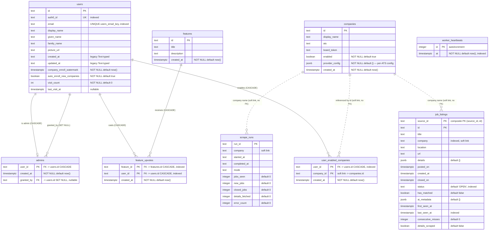

# Database Schema

This document describes the PostgreSQL schema for the Job-Visualizer-Notifier backend.

**Source of truth:** `src/backend/api/db_models.py` (SQLAlchemy declarative models). The
schema is applied/evolved exclusively through **Alembic** migrations under
`src/backend/alembic/versions/`. The ORM models here are *not* used for application
queries — the app issues raw `psycopg2` SQL via `scripts/shared/database.py`; the models
exist so Alembic autogenerate can diff model metadata against the live database. A parity
test keeps `db_models.py` and the migration chain in agreement.

Table names are **bare** (no `_{env}` suffix) across every environment. Test isolation is
done with per-worker Postgres *schemas* (`PYTEST_SCHEMA=test_<hex>` + `SET search_path`),
not table renaming.

## Entity-relationship diagram

> **"Soft link" (dotted lines)** means the column holds another table's key value but is
> *not* a declared foreign key — there is no referential-integrity constraint or cascade.
> `user_enabled_companies.company_id`, `job_listings.company`, and `scrape_runs.company`
> are all plain `Text` matched by convention, so a company id can appear in these tables
> without (or after) a corresponding `companies` row.

## Tables

### `users`
Authenticated accounts (Auth0 / Google One Tap). One row per person.

| Column | Type | Notes |
| --- | --- | --- |
| `id` | text PK | Internal user id. |
| `auth0_id` | text | Unique; indexed (`idx_users_auth0_id`). Issuer subject. |
| `email` | text | `UNIQUE users_email_key`; indexed (`idx_users_email`). |
| `display_name`, `given_name`, `family_name`, `picture_url` | text | Profile fields, nullable. |
| `created_at`, `updated_at` | **text** | Legacy string timestamps. Intentionally *not* `timestamptz`. |
| `company_enroll_watermark` | timestamptz | "I've decided about every company that existed as of this time." Companies created after it auto-enroll on read; bumped to `now()` on every save. `NOT NULL DEFAULT now()`. |
| `auto_enroll_new_companies` | boolean | Global per-user opt-out for auto-enroll. `NOT NULL DEFAULT true`. |
| `visit_count` | integer | Page-load count for the admin roster's "most frequent users" view; incremented once per full load via `POST /api/users/visit`. `NOT NULL DEFAULT 0`. |
| `last_visit_at` | timestamptz | Most recent page-load time; `NULL` until the user's first visit after this feature shipped. |

### `user_enabled_companies`
Join table — which companies a user has explicitly enabled in their feed. Composite PK
`(user_id, company_id)`. **Semantics:** *zero rows = "see all companies"* (implicit); ≥1 row
= explicit allow-list. `company_id` is a soft link to `companies.id`.

### `companies`
The tracked-company catalogue. `ats` names the provider (greenhouse, ashby, lever, gem,
eightfold, workday). `provider_config` JSONB carries per-ATS settings (Eightfold:
`{tenant_host, domain}`; Workday: `{base_url, tenant_slug, career_site_slug, default_facets?}`).
`created_at` is what the auto-enroll watermark compares against.

### `admins`
Admin grants. PK `user_id` → `users.id` (CASCADE). `granted_by` → `users.id` (SET NULL) so
deleting the granter keeps the grant.

### `features` / `feature_upvotes`
Feature-request voting. `feature_upvotes` is a join table with composite PK
`(feature_id, user_id)`, both FKs CASCADE.

### `job_listings`
Scraped postings. Composite PK `(source_id, id)` — `source_id` namespaces ids per scraper.
`status` (`OPEN`/`CLOSED`), `first_seen_at`/`last_seen_at`/`consecutive_misses` drive the
open→closed lifecycle. Indexed on `status`, `company`, `last_seen_at`.

### `scrape_runs`
One row per scrape execution — bookkeeping/metrics (`jobs_seen`, `new_jobs`, `closed_jobs`,
`details_fetched`, `error_count`). `started_at`/`completed_at` are legacy `Text`.

### `worker_heartbeats`
Liveness ticks written by the Procrastinate worker's periodic task every 5 min; `MAX(at)`
backs `/health/worker`. A cleanup task prunes rows older than 24h. Indexed on `at`.

## Notes on conventions

- **Timestamp split:** newer tables use `timestamptz` (`TIMESTAMP(timezone=True)`); the
  oldest columns (`users.created_at/updated_at`, `scrape_runs.started_at/completed_at`) are
  `Text`. Don't copy the legacy `Text` pattern for new columns.
- **Migrations:** edit `db_models.py`, then `alembic revision --autogenerate`, then review.
  Collapse multiple `op.add_column` calls into a single `ALTER TABLE` (combined-ALTER rule —
  see `docs/incidents/2026-04-18-migration-filled-postgres-volume/`). Never hand-edit a
  frozen revision; data migrations are the one documented exception to autogenerate-only.
