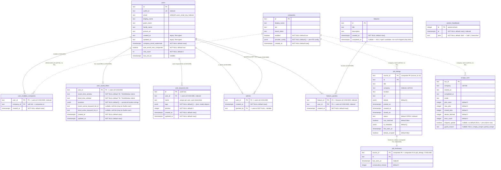

# Database Schema

This document describes the PostgreSQL schema for the Job-Visualizer-Notifier backend.

**Source of truth:** `src/backend/api/db_models.py` (SQLAlchemy declarative models). The
schema is applied/evolved exclusively through **Alembic** migrations under
`src/backend/alembic/versions/`. The ORM models here are *not* used for application
queries — the app issues raw `psycopg2` SQL via `scripts/shared/database.py`; the models
exist so Alembic autogenerate can diff model metadata against the live database. A parity
test keeps `db_models.py` and the migration chain in agreement.

Table names are **bare** (no `_{env}` suffix) across every environment. Test isolation is
done with per-worker Postgres *schemas* (`PYTEST_SCHEMA=test_<hex>` + `SET search_path`),
not table renaming.

## Entity-relationship diagram

```mermaid
erDiagram
    users ||--o{ user_enabled_companies : "enables (CASCADE)"
    users ||--o| user_saved_filters : "has saved filters (CASCADE)"
    users ||--o{ user_keyword_lists : "owns keyword lists (CASCADE)"
    users ||--o| admins : "is admin (CASCADE)"
    users ||--o{ admins : "granted_by (SET NULL)"
    users ||--o{ feature_upvotes : "casts (CASCADE)"
    features ||--o{ feature_upvotes : "receives (CASCADE)"
    companies ||..o{ user_enabled_companies : "referenced by id (soft link, no FK)"
    companies ||..o{ job_listings : "company name (soft link, no FK)"
    companies ||..o{ scrape_runs : "company name (soft link, no FK)"
    job_listings ||--|| job_freshness : "freshness sidecar (composite FK, CASCADE)"

    users {
        text id PK
        text auth0_id UK "indexed"
        text email "UNIQUE users_email_key, indexed"
        text display_name
        text given_name
        text family_name
        text picture_url
        text created_at "legacy Text-typed"
        text updated_at "legacy Text-typed"
        timestamptz company_enroll_watermark "NOT NULL default now()"
        boolean auto_enroll_new_companies "NOT NULL default true"
        int visit_count "NOT NULL default 0"
        timestamptz last_visit_at "nullable"
    }

    user_enabled_companies {
        text user_id PK "FK -> users.id CASCADE, indexed"
        text company_id PK "soft link -> companies.id"
        timestamptz created_at "NOT NULL default now()"
    }

    user_saved_filters {
        text user_id PK "FK -> users.id CASCADE"
        text recent_time_window "NOT NULL default '3h', TimeWindow Literal"
        text trend_time_window "NOT NULL default '7d', TimeWindow Literal"
        jsonb locations "NOT NULL default [] — canonical location strings"
        text recent_active_keyword_list_id "nullable, soft link (may be 'builtin-swe')"
        text trend_active_keyword_list_id "nullable, soft link (may be 'builtin-swe')"
        timestamptz created_at "NOT NULL default now()"
        timestamptz updated_at "NOT NULL default now()"
    }

    user_keyword_lists {
        text id PK "uuid4 hex"
        text user_id FK "-> users.id CASCADE, indexed"
        text name "unique per user, case-insensitive"
        jsonb tags "NOT NULL default [] — {text, mode} objects"
        integer position "NOT NULL default 0"
        timestamptz created_at "NOT NULL default now()"
        timestamptz updated_at "NOT NULL default now()"
    }

    companies {
        text id PK
        text display_name
        text ats
        text board_token
        boolean enabled "NOT NULL default true"
        jsonb provider_config "NOT NULL default {} — per-ATS config"
        timestamptz created_at "NOT NULL default now()"
    }

    admins {
        text user_id PK "FK -> users.id CASCADE"
        timestamptz created_at "NOT NULL default now()"
        text granted_by FK "-> users.id SET NULL, nullable"
    }

    features {
        text id PK
        text title
        text description
        timestamptz created_at "NOT NULL default now()"
        timestamptz completed_at "nullable — NULL=open candidate, non-null=shipped (ship date)"
    }

    feature_upvotes {
        text feature_id PK "FK -> features.id CASCADE, indexed"
        text user_id PK "FK -> users.id CASCADE, indexed"
        timestamptz created_at "NOT NULL default now()"
    }

    job_listings {
        text source_id PK "composite PK (source_id, id)"
        text id PK
        text title
        text company "indexed, soft link"
        text location
        text url
        jsonb details "default {}"
        timestamptz posted_on
        timestamptz created_at
        timestamptz closed_on
        text status "default 'OPEN', indexed"
        boolean has_matched "default false"
        jsonb ai_metadata "default {}"
        timestamptz first_seen_at
        boolean details_scraped "default false"
    }

    job_freshness {
        text source_id PK "composite PK + composite FK to job_listings, CASCADE"
        text id PK
        timestamptz last_seen_at "indexed"
        integer consecutive_misses "default 0"
    }

    scrape_runs {
        text run_id PK
        text company "soft link"
        text started_at
        text completed_at
        text mode
        integer jobs_seen "default 0"
        integer new_jobs "default 0"
        integer closed_jobs "default 0"
        integer details_fetched "default 0"
        integer error_count "default 0"
        boolean skipped_update "nullable, no default (NULL = pre-column row)"
        text guard_reason "nullable: NULL | empty_scrape | partial_scrape"
    }

    worker_heartbeats {
        integer id PK "autoincrement"
        timestamptz at "NOT NULL default now(), indexed"
        text lane "NOT NULL default 'bulk' — 'bulk' | 'interactive'"
    }
```

> **"Soft link" (dotted lines)** means the column holds another table's key value but is
> *not* a declared foreign key — there is no referential-integrity constraint or cascade.
> `user_enabled_companies.company_id`, `job_listings.company`, and `scrape_runs.company`
> are all plain `Text` matched by convention, so a company id can appear in these tables
> without (or after) a corresponding `companies` row. The
> `user_saved_filters.recent_active_keyword_list_id` / `trend_active_keyword_list_id`
> pointers are likewise plain `Text` (not FKs) because they may hold the synthetic
> built-in id `'builtin-swe'`, which has no `user_keyword_lists` row; the service layer
> enforces ownership and NULLs a pointer when its list is deleted.

## Tables

### `users`
Authenticated accounts (Auth0 / Google One Tap). One row per person.

| Column | Type | Notes |
| --- | --- | --- |
| `id` | text PK | Internal user id. |
| `auth0_id` | text | Unique; indexed (`idx_users_auth0_id`). Issuer subject. |
| `email` | text | `UNIQUE users_email_key`; indexed (`idx_users_email`). |
| `display_name`, `given_name`, `family_name`, `picture_url` | text | Profile fields, nullable. |
| `created_at`, `updated_at` | **text** | Legacy string timestamps. Intentionally *not* `timestamptz`. |
| `company_enroll_watermark` | timestamptz | "I've decided about every company that existed as of this time." Companies created after it auto-enroll on read; bumped to `now()` on every save. `NOT NULL DEFAULT now()`. |
| `auto_enroll_new_companies` | boolean | Global per-user opt-out for auto-enroll. `NOT NULL DEFAULT true`. |
| `visit_count` | integer | Page-load count for the admin roster's "most frequent users" view; incremented once per full load via `POST /api/users/visit`. `NOT NULL DEFAULT 0`. |
| `last_visit_at` | timestamptz | Most recent page-load time; `NULL` until the user's first visit after this feature shipped. |

### `user_enabled_companies`
Join table — which companies a user has explicitly enabled in their feed. Composite PK
`(user_id, company_id)`. **Semantics:** *zero rows = "see all companies"* (implicit); ≥1 row
= explicit allow-list. `company_id` is a soft link to `companies.id`.

### `user_saved_filters`
Scalar per-user saved filters — one row per user, PK `user_id` → `users.id` (CASCADE).
`recent_time_window` / `trend_time_window` are plain `Text` validated to the `TimeWindow`
Literal at the Pydantic boundary (same pattern as `job_listings.status`), defaulting to
`'3h'` / `'7d'`. `locations` is a JSONB array of canonical location strings shared by the
Recent and Trend pages. `recent_active_keyword_list_id` / `trend_active_keyword_list_id`
are nullable `Text` soft links to `user_keyword_lists.id` (or the synthetic `'builtin-swe'`).

### `user_keyword_lists`
Reusable named keyword lists — many per user. `id` is an app-generated uuid4 hex; `user_id`
→ `users.id` (CASCADE), indexed (`idx_user_keyword_lists_user_id`). `tags` is a JSONB array
of `{text, mode}` objects (`mode` ∈ `include`/`exclude`), shape/caps validated by Pydantic on
write. `name` is unique per user **case-insensitively** via the functional unique index
`uq_user_keyword_lists_user_name` on `(user_id, lower(name))`. The built-in "Software
Engineering" list (`builtin-swe`) is synthesized server-side and is NOT stored here, but its
name is reserved against this index.

### `companies`
The tracked-company catalogue. `ats` names the provider (greenhouse, ashby, lever, gem,
eightfold, workday). `provider_config` JSONB carries per-ATS settings (Eightfold:
`{tenant_host, domain}`; Workday: `{base_url, tenant_slug, career_site_slug, default_facets?}`).
`created_at` is what the auto-enroll watermark compares against.
`enabled = FALSE` is the soft-deactivation switch: the row and all of its historical
`job_listings` / `scrape_runs` are preserved, but the company is skipped by the worker
fan-out, omitted from `GET /api/companies`, excluded from auto-enroll, and — since the
2026-07-30 Unity retirement — its jobs are filtered out of the public `GET /api/jobs`
read paths (`services/database.py::_HIDDEN_COMPANY_PREDICATE`). The `/api/jobs-qa/stats`
and `/api/jobs-qa/scrape-runs` diagnostics deliberately still see it. Note the QA page's
Jobs table reads the public `/api/jobs`, so it does **not** — an operator sees a
deactivated company counted in the stats card but absent from the table below it.

### `admins`
Admin grants. PK `user_id` → `users.id` (CASCADE). `granted_by` → `users.id` (SET NULL) so
deleting the granter keeps the grant.

### `features` / `feature_upvotes`
Feature-request voting. `features.completed_at` is nullable: `NULL` marks an open
candidate users can still vote on; a non-null timestamp marks a shipped feature and
doubles as the ship date the frontend's "Shipped" section sorts by (most-recent first).
The startup seed reconcile (`features_seed.py`) stamps it idempotently for already-shipped
features. `feature_upvotes` is a join table with composite PK `(feature_id, user_id)`,
both FKs CASCADE.

### `job_listings`
Scraped postings. Composite PK `(source_id, id)` — `source_id` namespaces ids per scraper.
`status` (`OPEN`/`CLOSED`) plus `first_seen_at` here and `last_seen_at`/`consecutive_misses`
on the `job_freshness` sidecar drive the open→closed lifecycle. Indexed on `status`,
`company`, a partial `(first_seen_at)` for the enrichment claim, a partial `(id)` for the
open-only location search, and `idx_job_listings_problem_jobs` — a partial on
`(normalization_status)` whose predicate mirrors the admin problem-jobs filter exactly
(`normalization_status = 'failed' AND location IS NOT NULL AND btrim(location) <> ''`),
which is what makes the planner willing to use it. Of the 6,709 `failed` rows in prod only
182 have a non-blank location, so the full predicate indexes 37x fewer entries than the
equality alone. Finally `idx_job_listings_open_first_seen_keyset` — a partial on
`(first_seen_at, source_id, id)` `WHERE status = 'OPEN'` — backs keyset pagination on
`/api/jobs`: its column order is exactly the paged ORDER BY tuple, so Postgres serves the
all-DESC ordering with a **backward** index scan (no Sort node) and takes the
`(first_seen_at, source_id, id) < (…)` row-value cursor as an `Index Cond` rather than a
filter. Any request not filtering to `OPEN` (including one that omits `status`) falls off
it and sorts instead.

**Recency fields — which to trust (READ THIS before sorting/filtering by "recency"):**
- **`first_seen_at`** — **the effective posted date**, not literally "when we first saw it":
  seeded at INSERT from the board's own posting date when the board publishes a real one,
  and from first sight when it does not. Set once and **preserved across close→reopen**
  (`upsert_job` ON CONFLICT keeps it; `database.py`). This is **the** recency field — order by
  it for "freshest first" (the keyset ordering below; the `/api/internal/enrichment/pending`
  claim orders `first_seen_at DESC`). The full rule — including why a relative bucket like
  Workday's `"Posted 30+ Days Ago"` counts as no date at all — is in
  **`scripts/CLAUDE.md` § Job Lifecycle**.
- **`last_seen_at`** (on **`job_freshness`**, NOT `job_listings` — see below) — last scrape
  that still saw the job; **bumped to now() on every pass a job is still OPEN**, and drives
  close-detection (`consecutive_misses`). It signals "still actively listed," NOT freshness:
  it clusters at ~now across the whole open backlog, so it **cannot rank a job posted today
  above one open for months**. Good for "is it live," bad for prioritizing new work.
- **`posted_on`** — the **raw** ATS-supplied value, kept for diagnostics: it is the only place
  the board's own claim survives verbatim. **Still do not sort, filter or paginate on it.** It
  is mutable — it IS in `_UPSERT_ON_CONFLICT`, so every scrape re-stamps it and any cursor into
  an ordering keyed on it is invalidated by the next cycle. It is NULL wherever the board
  publishes nothing or only a bucket. And boards reuse/repost listings, so ~8.6% of OPEN rows
  carry a `posted_on` >180 days (some >16 years) before we first saw them. Its **credible**
  values already reach the product through `first_seen_at` — read that instead.
- **`created_at`** — DB row-insert time (`server_default now()`), and **the only column that
  still means that**: because `first_seen_at` now carries the board's date, a row inserted today
  can have a `first_seen_at` months old. Use `created_at`, never `first_seen_at`, for
  insert-time forensics — deploy correlation, spotting an onboarding batch. Not a user-facing
  recency signal. The frontend does not surface this column directly: the normalized
  `Job.createdAt` is built as `posted_on || first_seen_at` and used ONLY for the "Posted X ago"
  display label. Every frontend recency operation — the time-window filter, the "most recent"
  sort, the activity-over-time graph buckets, and the last-24h/3h counts — keys off `first_seen_at`
  (see `src/frontend/src/features/filters/utils/jobFilteringUtils.ts`, `lib/timeBucketing.ts`,
  `lib/date.ts`, and `Job.firstSeenAt` in `src/frontend/src/types/index.ts`). The backend
  `/api/jobs` list has **two orderings, and which one you get depends on the request**:
  the legacy shape (neither `?since=` nor `?cursor=`) is ordered by `last_seen_at DESC`
  ("still live"), while any keyset-paged request is ordered by the
  `(first_seen_at DESC, source_id DESC, id DESC)` tuple ("new to us", plus a unique
  tiebreak). The keyset path deliberately does NOT key off `last_seen_at`: it is re-stamped
  on every OPEN row every cycle, so a cursor into that ordering would be invalidated by the
  next scrape mid-walk. Cursors are only valid against the `first_seen_at` ordering.

### `job_freshness`
High-churn freshness sidecar for `job_listings`, keyed on the same composite
`(source_id, id)` and carrying a real composite FK `ON DELETE CASCADE`. Holds
`last_seen_at` + `consecutive_misses`, which the scraper re-stamps on every OPEN row every
hourly cycle. They used to live on `job_listings` itself; because `last_seen_at` is indexed,
each of those ~182 M updates was a non-HOT update that bloated both the wide 600 MB parent
and its index (46.8 MB / 691.8 B-per-row for 67.6k rows) until `/api/jobs` blew past the
30 s statement timeout. Moving them onto this ~50 B/row table keeps the churn off the
parent; the Unit 4 contract migration (`18fe9c20a8fd`) then dropped the parent copies and
`idx_job_listings_last_seen` entirely. An `AFTER INSERT` trigger on `job_listings` seeds a
freshness row (from `first_seen_at` + `0`) for every new listing regardless of insert path,
so the read-side INNER JOIN in `/api/jobs` is lossless and the two tables cannot drift.
Full story: `docs/incidents/2026-07-13-api-jobs-outage.md`,
`src/backend/docs/job-listings-bloat.md`.

### `scrape_runs`
One row per scrape execution — bookkeeping/metrics (`jobs_seen`, `new_jobs`, `closed_jobs`,
`details_fetched`, `error_count`). `started_at`/`completed_at` are legacy `Text`.

### `worker_heartbeats`
Liveness ticks written every 5 min; `MAX(at)` backs `/health/worker`. A cleanup task
prunes rows older than 24h. Indexed on `at`, and on `(lane, at)` for the per-lane probe.

`lane` names which Procrastinate worker wrote the tick — `bulk` or `interactive` (see
`_BULK_QUEUES` / `_INTERACTIVE_QUEUES` in `api/main.py`). Each lane's heartbeat task rides
a queue only that lane drains, so a fresh row proves *that* worker is dequeuing.
`/health/worker` 503s if either lane goes stale; without the tag, one dead worker would
hide behind the other's ticks.

## Notes on conventions

- **Timestamp split:** newer tables use `timestamptz` (`TIMESTAMP(timezone=True)`); the
  oldest columns (`users.created_at/updated_at`, `scrape_runs.started_at/completed_at`) are
  `Text`. Don't copy the legacy `Text` pattern for new columns.
- **Migrations:** edit `db_models.py`, then `alembic revision --autogenerate`, then review.
  Collapse multiple `op.add_column` calls into a single `ALTER TABLE` (combined-ALTER rule —
  see `docs/incidents/2026-04-18-migration-filled-postgres-volume/`). Never hand-edit a
  frozen revision; data migrations are the one documented exception to autogenerate-only.
