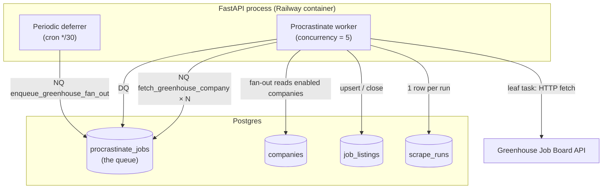
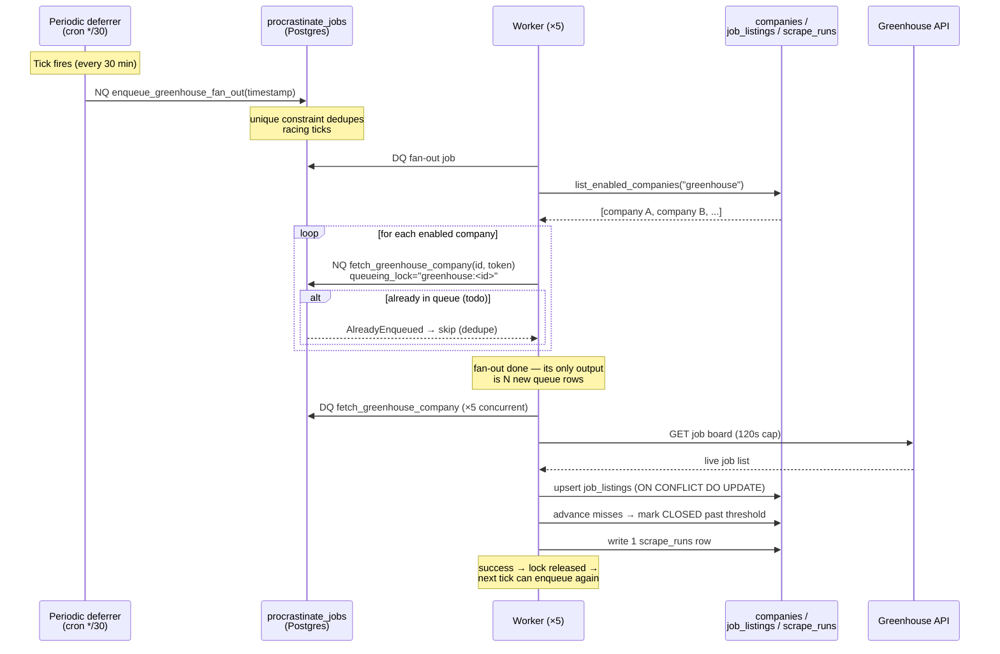
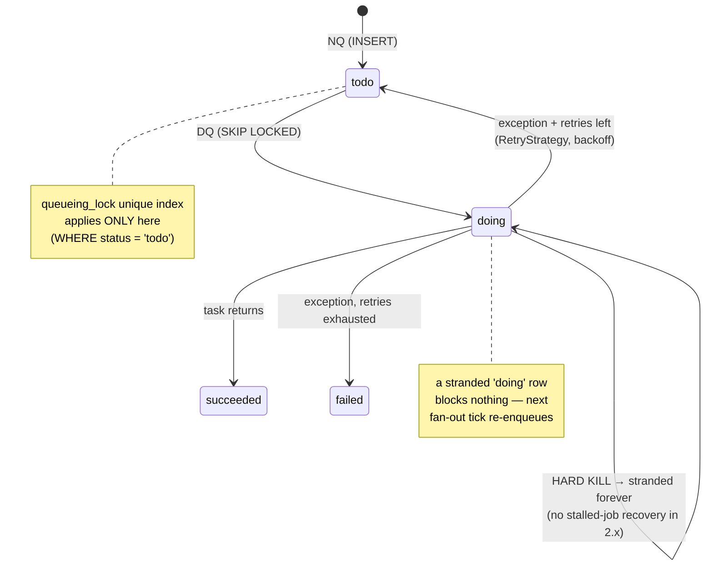
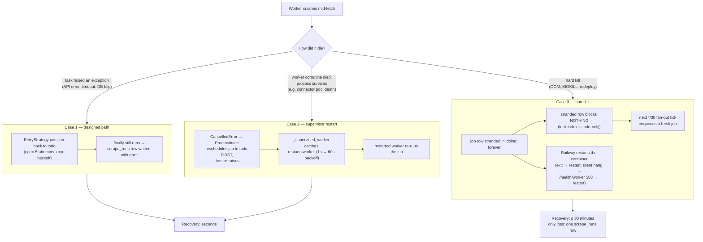

# Procrastinate Fan-Out Architecture

How the backend's job queue schedules, executes, and recovers ATS scrapes.
Covers the fan-out pattern, the full enqueue (NQ) / dequeue (DQ) lifecycle,
and what happens when the worker crashes mid-fetch.

All examples use Greenhouse; the other five ATSes (Ashby, Lever, Gem,
Eightfold, Workday) are identical in shape — each has its own
`enqueue_<ats>_fan_out.py` + `fetch_<ats>_company.py` pair registered in
`src/backend/api/tasks/__init__.py`.

Verified against Procrastinate **2.15.1** (the installed version). Behavior
notes that are version-specific are called out inline.

---

## 1. The cast

- **Queue** — the `procrastinate_jobs` table in Postgres. Procrastinate is a
  Postgres-backed queue: "enqueue" is an `INSERT`, "dequeue" is a
  `SELECT ... FOR UPDATE SKIP LOCKED`. The queue **survives worker crashes**
  because it lives in the database, not in the worker process.
- **Worker** — an in-process Procrastinate worker started in FastAPI's
  lifespan (`src/backend/api/main.py`), running with `concurrency=5`. The
  same worker also runs the **periodic deferrer** (the cron clock), so no
  external cron service is needed.
- **Fan-out task** — `enqueue_greenhouse_fan_out`, a periodic task fired
  every 30 minutes (`cron="*/30 * * * *"`). Its only job is to read the
  enabled-companies list from the DB and enqueue one leaf job per company.
- **Leaf task** — `fetch_greenhouse_company(company_id, board_token)`. Does
  the real work: fetch the ATS API, upsert `job_listings`, advance the
  closed-job lifecycle, write one `scrape_runs` row.



---

## 2. Why a fan-out task instead of enqueueing companies directly?

The cron scheduler **cannot** enqueue per-company jobs directly. The fan-out
task is the bridge between a *static* schedule and *dynamic* data:

1. **Static cron vs. dynamic data.** Procrastinate's `@periodic` decorator
   registers tasks at import time with a fixed `periodic_id` and no custom
   arguments (only the tick `timestamp`). The set of companies is **rows in
   the `companies` table**, not code — you cannot register a periodic job
   per DB row. The fan-out reads `list_enabled_companies` at tick time, so
   adding or disabling a company needs **no deploy and no worker restart**.
2. **Per-company dedupe needs defer-time logic.** The fan-out attaches
   `queueing_lock="greenhouse:<company_id>"` to each leaf defer. A
   slow/stuck company run cannot pile up duplicates across ticks, and a
   manual admin trigger + the periodic tick collapse to one in-flight job
   per company (the `AlreadyEnqueued` skip path). A dumb cron→N-jobs
   scheduler has nowhere to put that logic.
3. **Failure isolation at the right granularity.** The fan-out has its own
   `RetryStrategy(max_attempts=3)` for transient DB blips (so one network
   hiccup doesn't lose the whole 30-minute tick), and inside its loop a
   defer failure for company N logs and continues rather than starving
   companies later in the list. Each leaf fetch then fails and retries
   independently.
4. **Cheap idempotency at the top.** The fan-out itself carries **no**
   queueing lock on purpose — if two ticks race, the second is a no-op
   because every per-company defer is deduped by lock. One tiny coordinator
   job per tick costs almost nothing.

This is the standard "fan-out task" pattern in queue systems (Celery beat →
dispatcher → leaf tasks works the same way): cron triggers a **fixed**
coordinator, the coordinator expands it into **data-driven** work units.

---

## 3. The workflow, step by step



### Step 1 — Cron tick (nothing dequeued yet)

1. Every 30 minutes the periodic deferrer wakes up and **NQs one
   `enqueue_greenhouse_fan_out` job** with `timestamp=<tick epoch>`.
2. A unique constraint on periodic defers means if two workers/restarts
   race the same tick, only one row lands.

### Step 2 — Fan-out job DQ'd

1. The worker dequeues `enqueue_greenhouse_fan_out` and runs it.
2. It opens a DB connection and reads `list_enabled_companies(conn,
   "greenhouse")` — the **current** set of enabled companies.
3. For each company it **NQs one `fetch_greenhouse_company(company_id,
   board_token)` job**, each with `queueing_lock="greenhouse:<company_id>"`:
   - If a job for that company is **already sitting in the queue** (`todo`)
     from a previous tick or a manual trigger → `AlreadyEnqueued` → skip,
     no duplicate.
   - If a single defer hits a transient DB blip → log and continue with the
     remaining companies (one bad company doesn't starve the others).
4. The fan-out job completes. **Its only output is N new queue rows** — it
   touched no job data.

### Step 3 — Per-company jobs DQ'd (the real work)

The worker (concurrency 5) dequeues each `fetch_greenhouse_company` and,
under a 120-second wall-clock timeout:

1. **Fetch** the live Greenhouse Job Board API for that company's
   `board_token`.
2. **Safety guard**: if the API returned suspiciously few jobs
   (< `SAFETY_GUARD_RATIO` × currently-active count), write a `scrape_runs`
   row with `error_count=1` and **exit without writing** — no destructive
   closes on a flaky API response. This path returns normally, so it does
   not consume retries.
3. **Upsert** all fetched jobs into `job_listings`
   (`INSERT ... ON CONFLICT DO UPDATE`).
4. **Diff**: compare previously-active job IDs vs. the IDs just seen.
   Jobs that disappeared get their consecutive-miss counter advanced; past
   `MISSED_RUN_THRESHOLD` they are marked **CLOSED**.
5. **Record** one `scrape_runs` row (seen / new / closed counts) — written
   even on failure via the `finally` path.

### Step 4 — After each per-company job

- **Success** → job marked done; its queueing lock is released, so the
  *next* tick's fan-out can enqueue that company again.
- **Failure** (exception/timeout) → Procrastinate **retries up to 5×** with
  exponential backoff; the queueing lock holds while the job is queued, so
  the next fan-out tick skips it instead of stacking a duplicate.
- The frontend never sees any of this directly — it just reads `/api/jobs`,
  which queries whatever is in `job_listings` now.

### One-line summary

```
cron tick ──NQ──▶ fan_out job ──DQ──▶ reads companies table ──NQ──▶ N fetch jobs
                                                                       │ DQ (×5 concurrent)
                                                                       ▼
                                                    ATS API → upsert job_listings
                                                            → close missing jobs
                                                            → write scrape_runs row
```

Two NQ events (cron→fan-out, fan-out→fetches), two DQ events (fan-out, each
fetch). **Only the leaf fetch jobs ever touch job data.**

---

## 4. Job status lifecycle



Key facts (verified in Procrastinate 2.15.1's `schema.sql` and `worker.py`):

- The queueing-lock unique index is
  `ON procrastinate_jobs (queueing_lock) WHERE status = 'todo'`. Once a job
  moves to `doing`, the lock no longer blocks new enqueues for that company.
- Procrastinate 2.x has **no stalled-job recovery** (worker heartbeats and
  stalled-job retrieval arrived in 3.x), and this codebase doesn't implement
  one. A hard-killed job stays `doing` forever — harmlessly, per the index
  rule above.

---

## 5. What happens if the worker crashes mid-fetch?

The answer depends on *how* it crashes. Three distinct failure classes:



### Case 1 — The task raises an exception (API error, timeout, DB blip)

Not really a "crash" — this is the designed path:

1. Procrastinate catches the exception; `RetryStrategy(max_attempts=5,
   exponential_wait=2)` puts the job **back to `todo`** with a scheduled
   retry time.
2. The task's own `finally` block still runs, so a `scrape_runs` row with
   the error gets written.
3. After 5 failed attempts the job is marked `failed` permanently — but the
   next 30-minute fan-out tick enqueues a fresh one anyway.

### Case 2 — The worker coroutine dies, but the process survives

This is the 2026-05-19 incident class (connector pool death on a Railway DNS
blip — see `docs/incidents/2026-05-19-procrastinate-worker-died-on-dns-blip.md`):

1. The in-flight task gets a `CancelledError`. Procrastinate's
   `process_job` catches it as a critical `JobError`, **applies the retry
   strategy first** (job back to `todo`), *then* re-raises.
2. `_supervised_worker` (`src/backend/api/main.py`) catches the worker
   death and restarts it with exponential backoff (1s → 60s cap).
3. The restarted worker picks the job up again. Total loss: seconds.

> **Caveat:** rescheduling the job requires a working DB connection — if the
> crash *is* the DB connection dying, that write can fail too, and the job
> degrades to Case 3 behavior.

### Case 3 — Hard kill: OOM, SIGKILL, Railway redeploy mid-task

No Python runs, so nothing gets cleaned up:

1. The job row is **stranded in `doing` status forever** (no stalled-job
   recovery in Procrastinate 2.x; see §4).
2. **But the stranded row blocks nothing** — the queueing-lock index only
   applies to `todo` rows, so the next `*/30` fan-out tick enqueues a fresh
   fetch for that company without hitting `AlreadyEnqueued`.
3. Railway restarts the container:
   - process exit → restart;
   - silent hang → `worker_heartbeats` goes stale → `/health/worker`
     returns 503 → restart.
   The lifespan then re-starts the worker and the periodic deferrer.
4. **Worst case: that company's data is ~30 minutes late.** The only
   permanent loss is the `scrape_runs` row for the killed run (written in a
   `finally`, which doesn't execute on SIGKILL) — QA history shows a gap,
   not an error.

---

## 6. Why partial writes don't corrupt anything

If the kill lands mid-task, the write ordering in `fetch_greenhouse_company`
is deliberately crash-safe:

1. `upsert_jobs_batch` — `INSERT ... ON CONFLICT DO UPDATE`, idempotent.
2. Compute missing IDs → advance consecutive-miss counters.
3. `mark_jobs_closed` — idempotent (setting `CLOSED` twice is a no-op).

Properties that follow from this ordering:

- Closes only happen **after** upserts, so a crash can never close a job
  that was actually present in the API response.
- Whatever step the kill interrupted, the retry (or next tick's fresh job)
  just redoes the whole thing and **converges to the same state**.
- The in-flight HTTP request to the ATS is read-only, so losing it costs
  nothing.

---

## 7. Summary

| Failure class | Recovery mechanism | Time to recover | Permanent loss |
|---|---|---|---|
| Task raises exception | `RetryStrategy` (5×, exp. backoff) | seconds–minutes | none (error logged in `scrape_runs`) |
| Worker coroutine dies | retry-reschedule + `_supervised_worker` restart | seconds | none |
| Hard kill (OOM/SIGKILL/redeploy) | next fan-out tick + Railway container restart | ≤ 30 minutes | one `scrape_runs` bookkeeping row |

- Soft crashes self-heal in seconds via retry + supervisor.
- Hard crashes self-heal in ≤ 30 minutes via the next fan-out tick.
- Idempotent writes mean **no crash timing can corrupt job data**.

## Source files

| File | Role |
|---|---|
| `src/backend/api/tasks/enqueue_<ats>_fan_out.py` (×6) | Periodic fan-out tasks (cron → per-company defers) |
| `src/backend/api/tasks/fetch_<ats>_company.py` (×6) | Leaf tasks (fetch → upsert → close → record run) |
| `src/backend/api/tasks/procrastinate_app.py` | Procrastinate app instance + schema setup |
| `src/backend/api/tasks/heartbeat.py` | Worker liveness heartbeat (feeds `/health/worker`) |
| `src/backend/api/main.py` | Lifespan: worker supervision, `/health/worker` probe |
