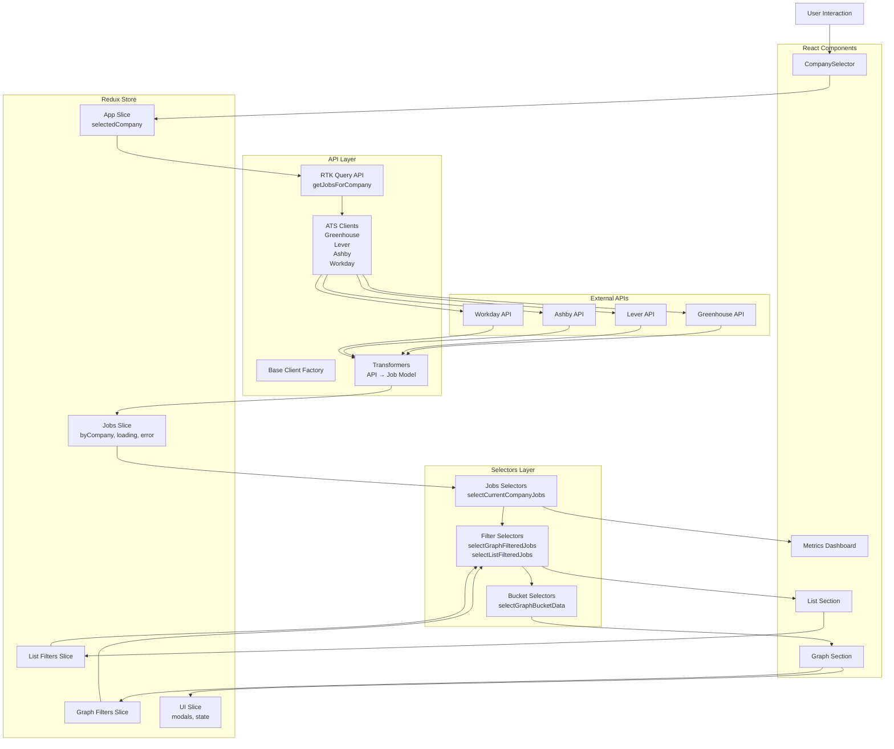
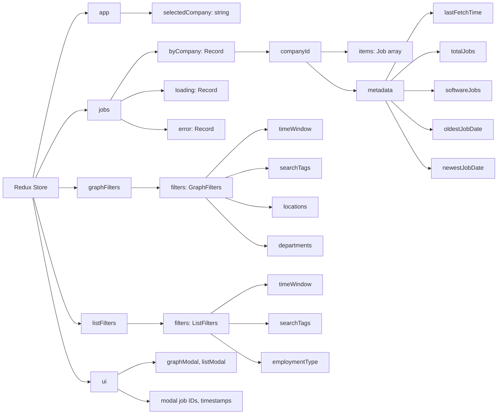
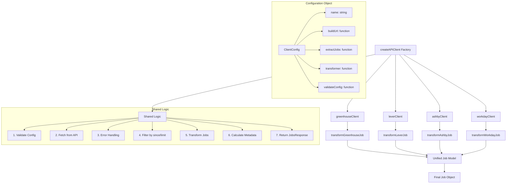
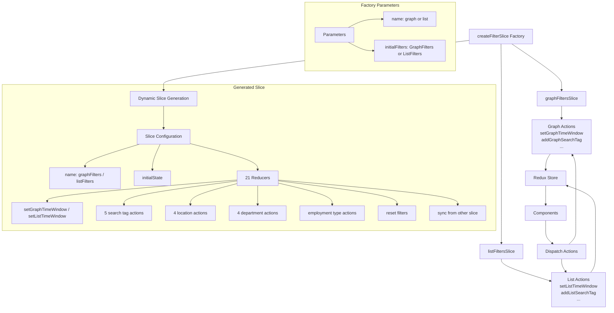
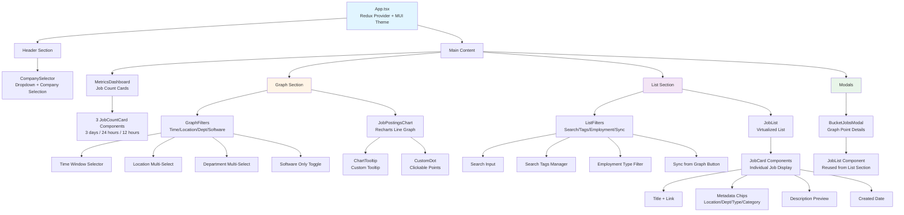
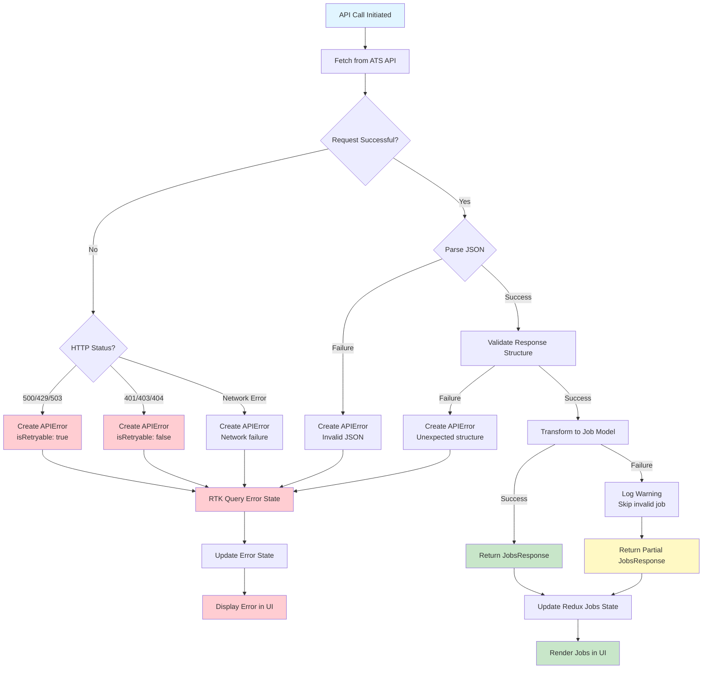

# Architecture Overview

This document provides visual diagrams and detailed explanations of the Job Visualizer application architecture.

## Table of Contents

1. [High-Level Data Flow](#high-level-data-flow)
2. [Redux State Shape](#redux-state-shape)
3. [API Client Architecture](#api-client-architecture)
4. [Filter Slice Architecture](#filter-slice-architecture)
5. [Component Hierarchy](#component-hierarchy)
6. [Time Bucketing Algorithm](#time-bucketing-algorithm)
7. [Role Classification System](#role-classification-system)

---

## High-Level Data Flow



User selects company → `getJobsForCompany` RTK Query endpoint → Factory selects API client → External API fetch → Transform to normalized Job model → RTK Query cache update → Memoized selectors filter data → Components render

---

## Redux State Shape



**Jobs Slice:**
```typescript
{
  byCompany: {
    [companyId]: {
      items: Job[],          // Normalized job array
      metadata: {
        lastFetchTime: string,
        totalJobs: number,
        softwareJobs: number,
        oldestJobDate: string,
        newestJobDate: string
      }
    }
  },
  loading: { [companyId]: boolean },
  error: { [companyId]: string | null }
}
```

**Filter Slices (Graph & List identical):**
```typescript
{
  filters: {
    timeWindow: TimeWindow,
    searchTags?: SearchTag[],
    locations: string[],
    departments: string[],
    employmentType?: EmploymentType
  }
}
```

Graph and list filters are completely independent. Jobs normalized by company ID for O(1) lookup.

---

## API Client Architecture



Factory eliminates 220+ lines of duplication. All four clients use identical error handling, filtering, and metadata calculation. Add new ATS provider in ~15 lines instead of 74.

---

## Filter Slice Architecture



Factory eliminates 158 lines of duplication. Both graph and list slices dynamically generate 21 action creators each: search tags (5), locations/departments (4 each), time window, employment type, reset, and sync actions.

---

## Component Hierarchy



App.tsx provides Redux/MUI setup. CompanySelector auto-loads jobs (single dispatch). MetricsDashboard shows job counts (no timer re-renders). Graph and List sections have independent filter systems with memoized data. BucketJobsModal reuses JobList for drill-down.

---

## Time Bucketing Algorithm

```mermaid
graph TB
    Start[Start: Jobs Array + Time Window]

    Start --> GetWindow[Get Time Window Duration]
    GetWindow --> CalcBucketSize[Calculate Bucket Size<br/>30m → 5min<br/>1h → 10min<br/>24h → 1hr<br/>7d → 1day]

    CalcBucketSize --> CalcRange[Calculate Time Range<br/>endTime = now<br/>startTime = now - window]

    CalcRange --> CreateBuckets[Create Empty Buckets]

    CreateBuckets --> Loop{For each bucket interval}

    Loop --> RoundStart[Round to bucket boundary<br/>align to bucket size]
    RoundStart --> CreateBucket[Create TimeBucket object<br/>bucketStart, bucketEnd<br/>jobs: array, count: 0]

    CreateBucket --> NextBucket{More buckets?}
    NextBucket -->|Yes| Loop
    NextBucket -->|No| FillBuckets[Fill Buckets with Jobs]

    FillBuckets --> JobLoop{For each job}
    JobLoop --> CheckTime{Job createdAt in range?}
    CheckTime -->|No| JobLoop
    CheckTime -->|Yes| FindBucket[Find matching bucket<br/>by timestamp]

    FindBucket --> AddJob[Add job ID to bucket<br/>Increment count]
    AddJob --> MoreJobs{More jobs?}
    MoreJobs -->|Yes| JobLoop
    MoreJobs -->|No| CalcCumulative[Calculate Cumulative Counts]

    CalcCumulative --> Cumulative[For each bucket:<br/>cumulativeCount = previous + current]
    Cumulative --> Sort[Sort buckets chronologically]
    Sort --> Return[Return TimeBucket array]

    Return --> End[End: Ready for Graph]

    style Start fill:#e1f5ff
    style End fill:#c8e6c9
    style CreateBuckets fill:#fff9c4
    style FillBuckets fill:#fff9c4
    style CalcCumulative fill:#fff9c4
```



### Bucket Size Mapping

| Time Window | Bucket Size | Max Buckets | Purpose |
|-------------|-------------|-------------|---------|
| 30m | 5 minutes | 6 | High granularity for recent activity |
| 1h | 10 minutes | 6 | Short-term trends |
| 3h | 30 minutes | 6 | Medium-term patterns |
| 6h | 1 hour | 6 | Half-day overview |
| 12h | 1 hour | 12 | Daily patterns |
| 24h | 1 hour | 24 | Full day cycle |
| 3d | 6 hours | 12 | Multi-day trends |
| 7d | 1 day | 7 | Weekly overview |
| 14d | 1 day | 14 | Two-week patterns |
| 30d | 1 day | 30 | Monthly view |
| 90d | 3 days | 30 | Quarterly trends |
| 180d | 6 days | 30 | Half-year overview |
| 1y | 12 days | 30 | Annual patterns |
| 2y | 24 days | 30 | Two-year trends |

Empty buckets created for entire range (critical for proper graph spacing). Buckets align to clean boundaries. Cumulative counts for line graphs. Time complexity: O(n + b). Results memoized via Redux selectors.

---

## Performance Optimizations

```mermaid
graph LR
    State[Redux State Changes]

    State --> Selectors[Memoized Selectors]

    Selectors --> L1[Level 1: Basic Selectors<br/>selectCurrentCompanyJobs<br/>selectGraphFilters]

    L1 --> L2[Level 2: Filtering<br/>selectGraphFilteredJobs<br/>selectListFilteredJobs]

    L2 --> L3[Level 3: Transformations<br/>selectGraphBucketData<br/>selectAvailableLocations]

    L3 --> Components[React Components]

    Components --> UseMemo[useMemo Hooks<br/>Chart data transformation<br/>Bucket job filtering]

    UseMemo --> UseCallback[useCallback Hooks<br/>Event handlers<br/>Modal actions]

    UseCallback --> Render[Final Render]

    style State fill:#e1f5ff
    style Selectors fill:#fff9c4
    style Components fill:#f3e5f5
    style Render fill:#c8e6c9
```



Selector memoization via `createSelector` from Reselect. Chart data wrapped in `useMemo`. Filter independence prevents cross-contamination. No timer re-renders in MetricsDashboard. Single dispatch in CompanySelector. RTK Query provides automatic caching and background refetching.

Key complexities: Load jobs O(n), time bucketing O(n + b), filtering O(n) memoized.

---

## Error Handling Flow



---

## Summary

This architecture provides clear separation of concerns, code reuse via factory patterns, RTK Query for efficient data fetching and caching, aggressive memoization, easy extensibility, full TypeScript coverage, comprehensive error handling, and efficient scaling to 1000+ jobs.

**Key Technologies:**
- RTK Query for API data management
- Redux Toolkit for UI state
- Factory patterns for API clients and filter slices
- Memoized selectors for performance
- Four ATS provider integrations (Greenhouse, Lever, Ashby, Workday)

For implementation details, see `CLAUDE.md`. For migration guidance, see `docs/MIGRATION.md`.
